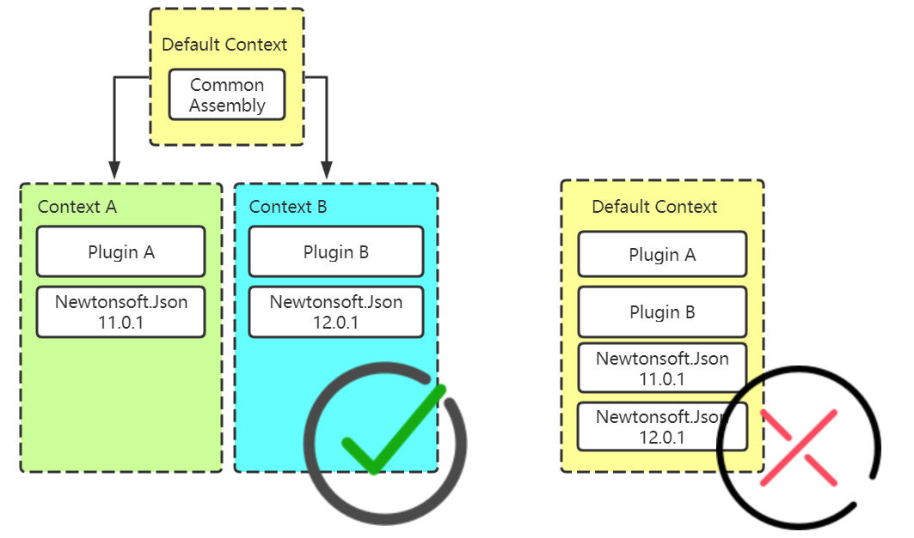
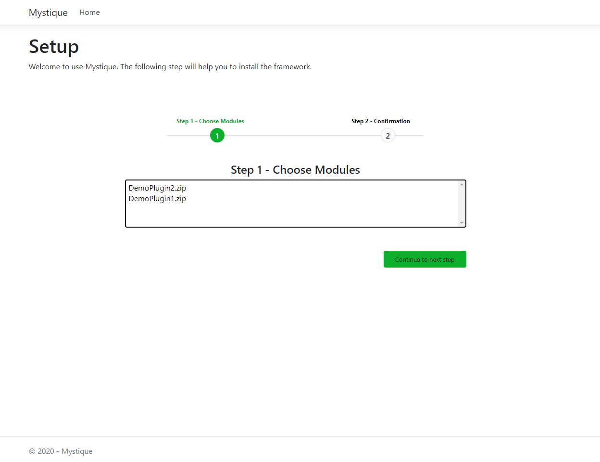

# Mystique
A sample about how to create a dynamic plugins mechanism with ASP.NET Core Mvc based on the AssemblyLoadContext.

This whole project is built under .NET Core 3.1 and .NET 5. 

## What i will do and what i will not do
I will build a plugin mechanism to load plugins at runtime. Each plugin will be isolated by custom AssemlyLoadContext. So the framework allow you to reference same library with different version.

## Getting Started
 - Clone the source code
 - Run `docker-compose up`
 - Install the pre-set modules

 - Start to use the system 

## Pain spot and solutions
I just list down all the pain spot when i approach this feature, If you are good at Chinese, you can reference my cnblog (https://www.cnblogs.com/lwqlun/p/13208980.html). I have list down all of these in my blog. I will translate a English version later.

### How to unload plugin at runtime?
Although a new method called Unload imported in the .net core 3.0, but when you unload the AssemblyLoadContext, it would still show the error message that the file is using, you could not remove them. 

So my solution is that my app use the `LoadFromStream` method to load plugin assembly instead of `LoadFromAssemblyPath`.

The another benifit for this is that you can cache and reuse the library stream. So if pluginA reference Newtonsoft.Json v11.0.0 and plugin B reference the same. After pluginA loaded, system will not load the same library when loading the PluginB. 

### How to enable controller/action at runtime?
Coming soon..

### How to enable views at runtime?
Coming soon..

### How to debug the plugin?
Coming soon..

### How to build a dynamic menu
Coming soon..

